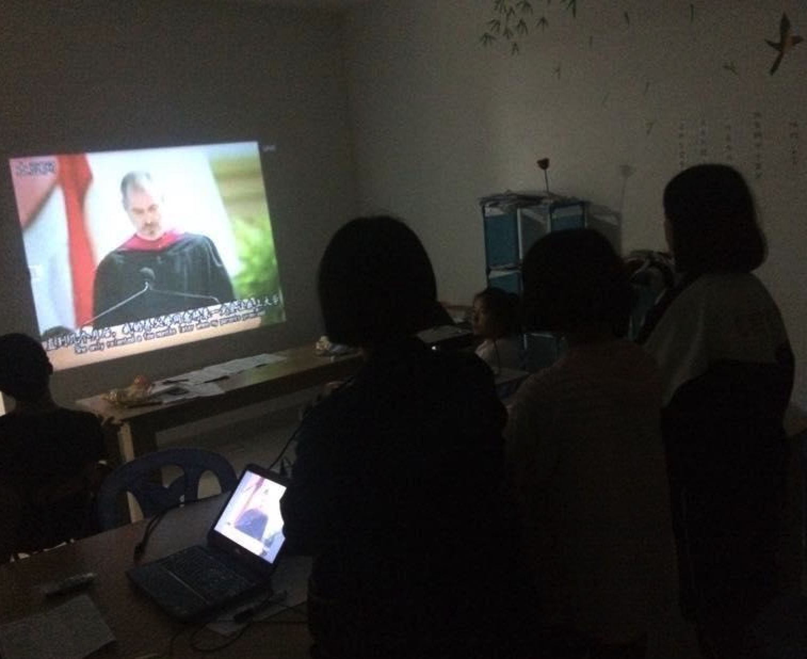

Stay hungry Stay foolish
======



In my early twenties, I embarked on a life-changing journey when I founded a tutoring program for students in rural areas. The first time I stood in front of my students, I shared with them one of the most impactful speeches I’ve ever encountered: Steve Jobs' commencement address at Stanford University, where he famously said, "Stay hungry, stay foolish." This was also the first time I used multimedia to teach these children, a moment that sparked my deep fascination with educational technology—a field that I’ve continued to explore ever since.

That speech became a cornerstone of my personal and professional philosophy, especially that timeless phrase, "stay hungry, stay foolish." It has guided me over the past decade as I navigated the intersections of Information and Communication Technology (ICT) and education. Jobs’ reflection on why technology had transformed almost every industry but had left education relatively untouched deeply resonated with me. This question remains a challenge for researchers and practitioners in the educational technology field today, as we continue to strive to find ways for technological advancements to meaningfully impact learning and teaching.

Over the years, I’ve witnessed the world of educational technology evolve through various phases—from the rise of MOOCs (Massive Open Online Courses) to the era of mobile learning, and now, the dawn of artificial intelligence in education. Each wave of innovation has offered new tools and opportunities, but the fundamental question of how to create lasting, transformative change in education remains as vital as ever.

Revisiting this speech today, I find myself reflecting on why I chose to enter the field of educational technology in the first place. Steve Jobs' words served as a guiding light during my formative years, pushing me to remain curious, open-minded, and bold in my pursuit of solutions. As I look ahead to the next ten years, my hope is to contribute new perspectives and breakthroughs to the ongoing conversation about the role of technology in education.

Here’s to staying hungry and staying foolish, as I continue this journey.

{: .align-center}
